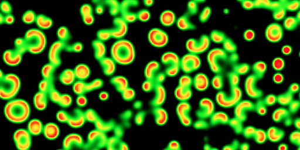
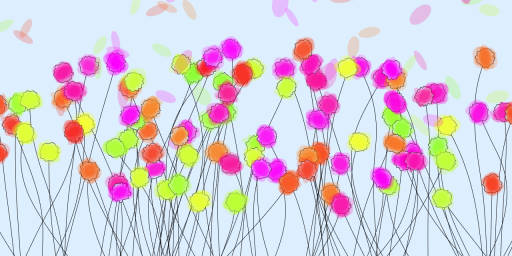
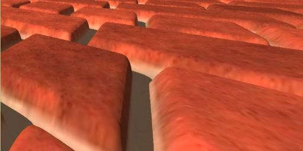

# Homepage

This repo is a hub giving access to all of my projects.
See the live version here: [piellardj.github.io](https://piellardj.github.io).

## Projects: Web

### Reaction-diffusion: [live](https://piellardj.github.io/reaction-diffusion-webgl/?page%3Atabs%3Amap-tabs-id=uniform&page%3Apicker%3Apresets-fixed-picker-id=0) / [repo](https://github.com/piellardj/reaction-diffusion-webgl)

### Diamond: [live](https://piellardj.github.io/diamond-webgl) / [repo](https://github.com/piellardj/diamond-webgl)

### Flowers: [live](https://piellardj.github.io/flowers-webgl/?page%3Acanvas%3Afullscreen=true) / [repo](https://github.com/piellardj/flowers-webgl)

### Ray marching: [live](https://piellardj.github.io/ray-marching-webgl) / [repo](https://github.com/piellardj/ray-marching-webgl)

### Packing: [live](https://piellardj.github.io/packing-webgl/?page%3Acanvas%3Afullscreen=true) / [repo](https://github.com/piellardj/packing-webgl)

### Rorschach: [live](https://piellardj.github.io/rorschach-webgl/?page%3Acanvas%3Afullscreen=true) / [repo](https://github.com/piellardj/rorschach-webgl)

### Strange Attractors: [live](https://piellardj.github.io/strange-attractors-webgl) / [repo](https://github.com/piellardj/strange-attractors-webgl)

### Reaction-diffusion: [live](https://piellardj.github.io/reaction-diffusion-webgl) / [repo](https://github.com/piellardj/reaction-diffusion-webgl)

### Threading: [live](https://piellardj.github.io/image-stylization-threading) / [repo](https://github.com/piellardj/image-stylization-threading)

### Dithering: [live](https://piellardj.github.io/image-stylization-sines/?page%3Atabs%3Apattern-tabs-id=1&page%3Arange%3Alines-count-range-id=70&page%3Arange%3Amax-frequency-range-id=0.18&page%3Atabs%3Alines-type-tabs-id=1&page%3Arange%3Amax-amplitude-range-id=0.5) / [repo](https://github.com/piellardj/image-stylization-sines)

### Sine waves: [live](https://piellardj.github.io/image-stylization-sines) / [repo](https://github.com/piellardj/image-stylization-sines)

### Picasso - Fourier: [live](https://piellardj.github.io/picasso-fourier) / [repo](https://github.com/piellardj/picasso-fourier)

### Chaos Game: [live](https://piellardj.github.io/chaos-game-webgl) / [repo](https://github.com/piellardj/chaos-game-webgl)

### Game of Life: [live](https://piellardj.github.io/game-of-life-webgl) / [repo](https://github.com/piellardj/game-of-life-webgl)

### Panoramas: [live](https://piellardj.github.io/panoramas-webgl) / [repo](https://github.com/piellardj/panoramas-webgl)

### Pool: [live](https://piellardj.github.io/pool-webgl/?page%3Acanvas%3Afullscreen=true&page%3Acanvas%3Asidepane=true) / [repo](https://github.com/piellardj/pool-webgl)

### Navier-Stokes: [live](https://piellardj.github.io/navier-stokes-webgl) / [repo](https://github.com/piellardj/navier-stokes-webgl)

### Waterfall: [live](https://piellardj.github.io/waterfall-webgl) / [repo](https://github.com/piellardj/waterfall-webgl)

### Paint: [live](https://piellardj.github.io/paint-webgl) / [repo](https://github.com/piellardj/paint-webgl)

### LDAP filter analyzer: [live](https://piellardj.github.io/ldap-filter-analyzer) / [repo](https://github.com/piellardj/ldap-filter-analyzer)

## Projects: OpenGL / other

### Voxelizer: [repo](https://github.com/piellardj/voxelizer-gpu)

### Parallax mapping: [repo](https://github.com/piellardj/parallax-mapping)

### Fractal navigator: [repo](https://github.com/piellardj/fractal-navigator)

### Particles: [repo](https://github.com/piellardj/particles-gpu)

### Sampler 2D: [repo](https://github.com/piellardj/sampler2D)
